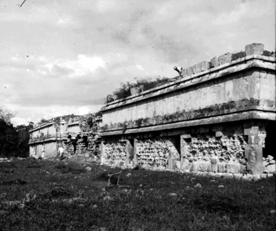
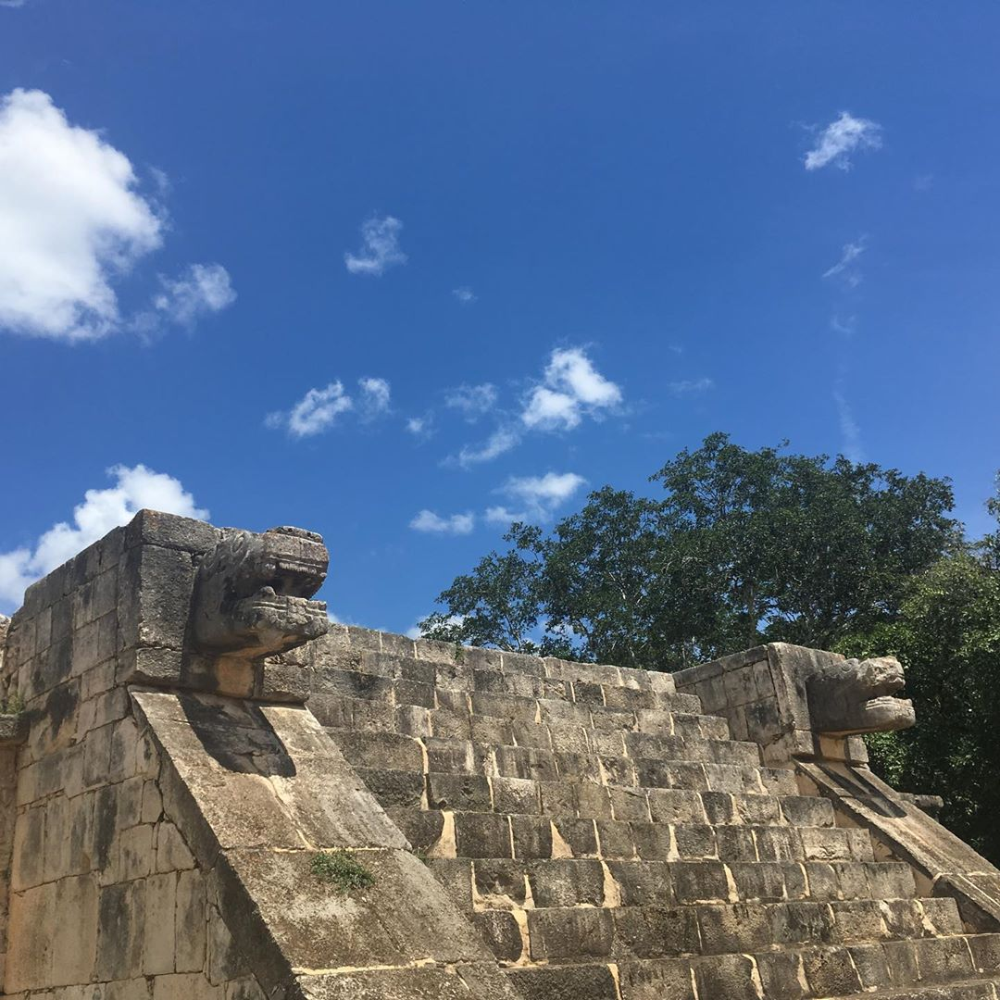
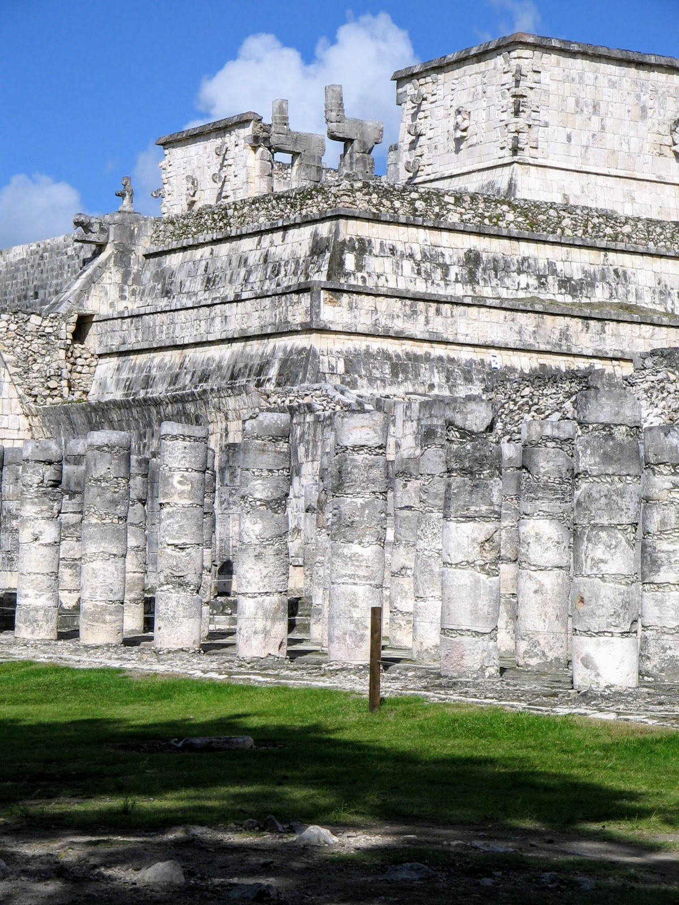
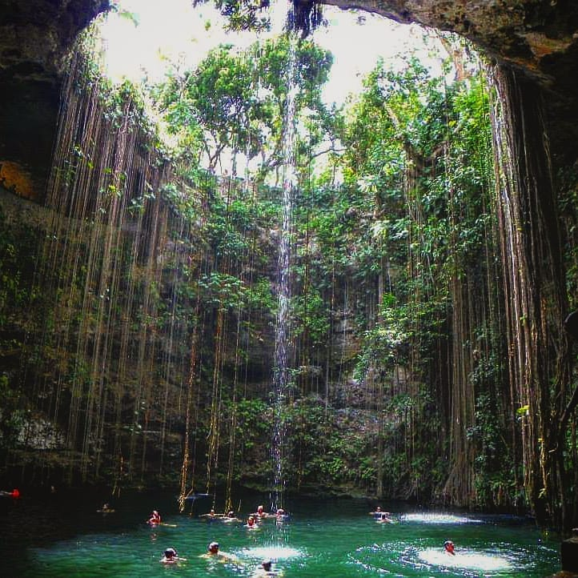
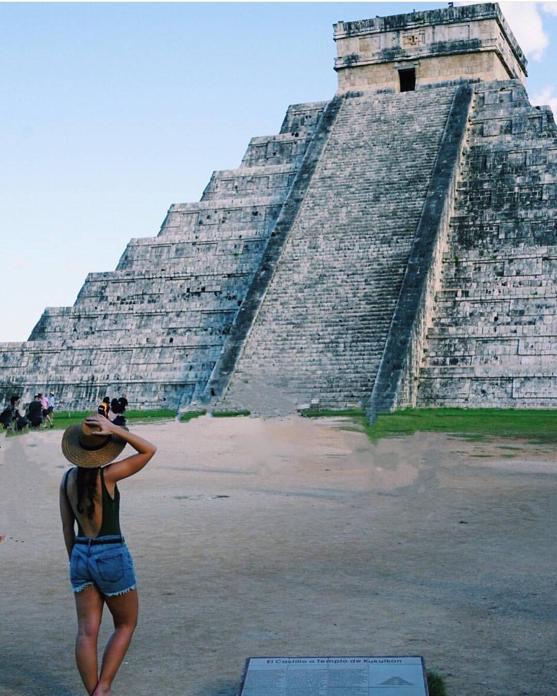

import { Link } from "gatsby"

_Ven por la cultura, quédate por el asombro_ aquí en Chichen Itzá la tierra de los brujos del mar no dejarás de sorprenderte por cultura milenaria.

Chichén Itzá se localiza al Oriente del estado de Yucatán, por la carreta a Cancún, a 120 km de la ciudad de Mérida. Chichén Itzá ("Boca del pozo de los itzaes") es uno de los lugares más controvertidos del mundo Maya, de los más estudiados y el más visitado. Su historia y su cronología son objetos de debates; la procedencia de sus habitantes es todavía un rompecabezas, los arqueólogos modifican sus teorías a medida que las excavaciones avanzan.

<blockquote display="info">Chichén Itzá fue declarada una de las 7 Maravillas del Mundo Moderno</blockquote>

Este sitio, declarado Patrimonio de la Humanidad en 1988 y una de las Siete Maravillas del Mundo moderno en 2010, combina grandeza y naturaleza. Entre acacias, orquídeas o flamboyanes, interesantes hallazgos del pasado son estudiados. Entre iguanas, armadillos y coatíes se revela alguna leyenda o misterio; entre codornices, golondrinas y lechuzas descubramos al precioso pájaro tho, de color azul turquesa con su canto suave, mientras miramos con respeto algunos de sus caminos prehispánicos.

https://youtu.be/kAL8Pd58-oY

Los Itzaés se establecieron en Chichén Itzá en el siglo IX d.C. Se cree que eran mayas putunes o chontales. Forjaron un amplio dominio con una cultura unificada cuyo centro era Chichén Itzá, sin embargo, hacia 1250 d.C., la ciudad fue abandonada por razones no del todo determinadas. Tan grande fue el poderío de esta ciudad que siglos después de su decadencia aún era sitio de peregrinación y adoración, e incluso hacia el año 1540 d.C. Francisco de Montejo, fundador de Mérida, pensó levantar la capital allí.

En su época de mayor esplendor, Chichén Itzá llegó a abarcar 25 km2. El centro religioso, cultural y administrativo abarcaba unos 6 km2; a poca distancia del mismo habitaba la elite, en edificios tipo palacio, decorados con esmero y pintados de colores brillantes. Alrededor de éstos, en verdes campos, vivían entre 50 mil y 100 mil personas en palapas de techo de palma.

El Castillo de Kukulcán, con sus 30 metros de altura, es la construcción más imponente. Su antigüedad es difícil de calcular, se estiman fechas que van entre 650 a 800 d.C. Los números de sus medidas están relacionados con las cifras del calendario solar maya, por ejemplo: 91 escalone x 4 lados: 364, más la plataforma: 365, los días del año. Los cinco adornos a cada lado del templo dan: 5 x 4: 20, los días del mes maya. En éste edificio, donde se plasma la exactitud del profundo conocimiento de los mayas, se puede ver la deidad Kukulcán "La Serpiente emplumada" descender puntualmente en cada equinoccio, en un fenómeno de Luz y sombra que atrae a miles de visitantes de todas partes del mundo.

https://youtu.be/c5vvbn6-h_E

El juego de Pelota que tuvo un significado cósmico, con sus símbolos bélicos y una acústica casi perfecta, es una de las construcciones más antiguas del lugar con fecha inscrita de 864 d.C.

Visitar este majestuoso sitio es adentrarse a un capítulo indispensable en la historia del pueblo maya, no puede nadie venir a Yucatán sin recorrer la Gran Chichén Itzá, y culminar este encuentro con los mayas disfrutando su espectáculo de Luz y sonido ofrecido todas las noches del año.
<blockquote>Ven y enamórate de Yucatán</blockquote>

### El Akab Dzib

El Akab Dzib es otro peculiar monumento libre de la influencia tolteca, que se compone de un edificio central y dos cuartos en los extremos, con 18 cuartos techados de bóveda maya que se anexaron posteriormente, divididos en dos edificios. Su aspecto es de gran sencillez, su fachada está compuesta por un muro liso que en la parte superior tiene dos molduras y está rematado por una crestería.

En total, el Akab Dzib mide 54 metros de largo por 16 de ancho y seis de altura. Los antiguos mayas imprimieron huellas de sus manos en color rojo en el interior de algunos de los cuartos situados hacia el oeste, para simbolizar quizá a Kabul ("mano celeste y creadora"), dios maya de la bóveda celeste.

En el dintel de una de las puertas interiores de la sección sur del edificio, se observa el grabado de un sacerdote rodeado de un dintel de piedra con símbolos jeroglíficos que no han podido ser descifrados, salvo por la fecha del año 869. Esta dificultad de interpretación dio su nombre al edificio, derivado de akab, "noche", y dzib, "escritura", lo que se interpreta como "escritura oscura", es decir, difícil de interpretar o traducir.	 
 

### Plataforma de Venus

Este monumento cuadrado mide 25 metros por lado y cuatro de alto, con escalinatas en cada una de sus caras. Situado como a 100 metros al norte del Castillo, fue llamado así por las estrellas grabadas en las esquinas, interpretadas como el luminoso planeta Venus. La estructura está formada por un talud y una sección vertical con paneles salientes y espacios hundidos intercalados.

Una cornisa remata el conjunto. Sobre los paneles salientes están los bajorrelieves mencionados, que muestran al planeta Venus representado por medias flores con aspas en los pétalos, rodeados por la figura de estera trenzada, o pop, en maya, símbolo del poder. También está presente Kukulcán surgiendo de entre las fauces de una serpiente emplumada con garras de jaguar. Los bajorrelieves de piedra aún conservan restos de pintura roja, azul y amarilla que ornamentaba los contornos de la representación del "lucero de la mañana" o "estrella-abeja", una de las manifestaciones de Kukulcán-Quetzalcóatl más admirada por los hombres prehispánicos. La misma figura remata las balaustradas de las escalinatas en los tableros de la cornisa, que ostentan a las serpientes emplumadas, en movimiento, con peces entre sus ondulaciones.

### Templo de los guerreros

De gran importancia, dado el espíritu militarizado de los constructores de Chichén Itzá, este templo, que forma parte del conjunto de las Mil Columnas, tiene gran semejanza con las construcciones toltecas, especialmente con el Tlahuizcalpantecutli, de Tula, templo de armoniosas proporciones, precedido por un vestíbulo en el que hay casi 100 pilastras, denominado por algunos como "de Quetzalcóatl".

La estructura, que comenzó a restaurarse desde 1925 y está considerada una de las más bellas de Chichén Itzá, es un basamento piramidal con cuatro cuerpos escalonados, cuyos muros en talud rematan en tableros, tres de los cuales están decorados con guerreros, águilas y jaguares que devoran corazones humanos. El exterior de la pared vertical está adornado con motivos en los que se mezclan elementos mayas y toltecas en la representación de dos deidades: los primeros, mascarones del dios Chaac; y los segundos, de Kukulcán saliendo de las fauces de una serpiente emplumada.

En la parte superior, el templo se compone de dos grandes salas; la primera tiene una puerta dividida en tres vanos por medio de pilastras con la efigie de Kukulcán, que sostuvieron un techo en forma de bóveda. Una abertura en la pared comunica con la cámara posterior, o santuario. En su interior se ven ocho pilastras de piedra y, al fondo, una mesa o altar de losas adosado al muro, sostenido por pequeñas estatuas con forma de guerreros o "atlantes".

### Cenote Xtoloc

Aproximadamente a unos 150 metros hacia el noreste del Observatorio, hay un pozo natural que sirvió como depósito de agua para los pobladores de Chichén Itzá, que contrasta mucho con el grandioso Cenote Sagrado. Sin embargo, su importancia fue vital para los habitantes de Chichén Itzá.

En su momento, el Xtoloc estuvo rodeado por chultunes o cisternas que suministraron agua a la población. En el centro, a unos 20 metros de la orilla, hay un singular templete con columnas y un santurario, que constó de tres cámaras que descansaron sobre una plataforma baja. Al parecer, estuvieron techadas con bóveda angular.

El cenote Xtoloc, que debe su nombre a la gran iguana común que existe en Yucatán, consta también de una pequeña rampa que fue construida por los mayas, a fin de que se pudiera caminar hasta el nivel del líquido y llenar el recipiente.

## Hoteles en Chichén Itzá
import InsertaScript from  "../../components/Complete/InsertaScript"

<InsertaScript liga="https://www.travelpayouts.com/blissey/scripts_es.js?categories=popularity&id=4384&type=compact&marker=182367.tyucatan&powered_by=false&host=hoteles.tyucatan.com%2Fhotels&locale=es&currency=mxn&limit=10&nobooking=true" />

#### Ubicación de Chichen Itzá
import Map from "../../components/Map"

<Map
          lat="20.683351"
          lng="-88.568652"
          zoom={9}
          mensaje="El Castillo de Chichén Itzá"
/>

<Link to="/posts" className="btn center-btn">
  todos los posts
</Link>
