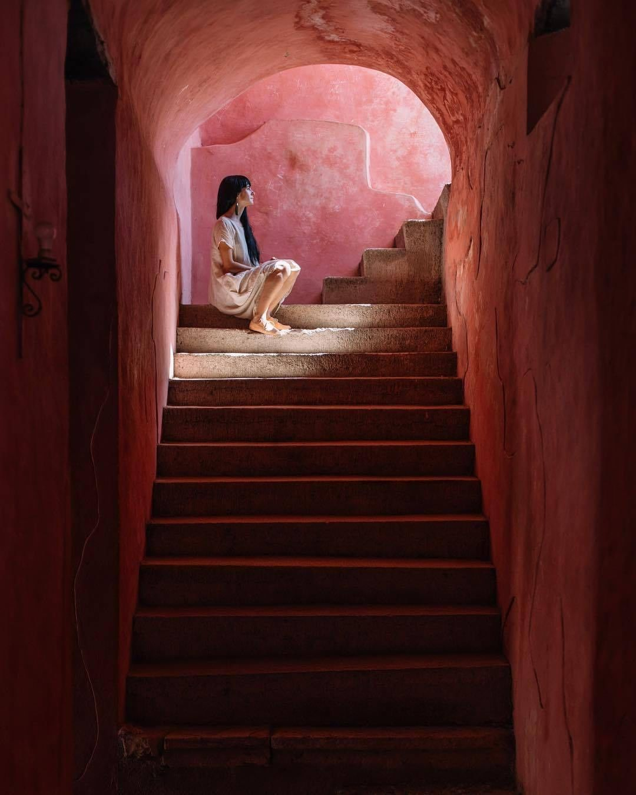

_Calles llenas de color e historia esperan conocerte en Yucatán._

<blockquote display="info">
    <h3>No te puedes perder...</h3>
    <ul>
    <li> <a href="merida">Mérida</a>, una ciudad próspera llena de grandiosa arquitectura colonial.</li>
    <li> <a href="chichen-itza">Chichén Itzá</a>, el gran centro ceremonial Maya catalogado entre las 7 maravillas del mundo moderno.</li>
    <li> Ría Lagartos, hogar de la más grande colonia de Flamencos en México.</li>
    <li> <a href="uxmal">Uxmal</a>, la elegante ciudad principal de la región Puuc.</li>
    <li> <a href="izamal">Izamal</a>, la ciudad Amarilla hogar de un sorprendente convento Franciscano.</li>
    </ul>
</blockquote>

El **Estado de Yucatán** se encuentra en la parte superior de la península de Yucatán. 
Hasta el desarrollo de Cancún en la vecina Quintana Roo, era el motor económico de la península.
Fue a partir del estado de Yucatán, a mediados del siglo XIX, 
que la fibra derivada de las plantas de agave se convirtió en un hilo llamado Henequén. 
El Henequén se enviaba a todo el mundo, 
y no fue sino hasta el advenimiento de las fibras sintéticas un siglo después que el Henequén cayó en desgracia en el mercado mundial.
Todavía existen las grandes haciendas henequeneras y realmente vale la pena visitarlas.

https://youtu.be/TkCjNBGsU5g

Si bien la economía impulsada por el turismo de Quintana Roo ha superado a la de Yucatán en los últimos años, 
histórica y culturalmente Yucatán sigue siendo el estado principal de la península. 
Dentro del estado encontrará las ruinas mayas más impresionantes de la península 
([Chichén Itzá](chichen-itza) y [Uxmal](uxmal)), sus mejores ciudades coloniales 
([Mérida](merida), [Valladolid](valladolid) e [Izamal](izamal)) 
y dos comunidades costeras nacionalmente famosas por sus flamencos rosas (Río Lagartos y [Celestún](celestun)). 
También en este estado a menudo sofocante de 1,5 millones de personas, 
los visitantes encontrarán muchas haciendas majestuosas 
y, en las Grutas de Loltún, grandiosas cuevas que hacen que la exploración sea memorable.

Como destino turístico, el Yucatán tradicional complementa a el cada vez más comercial Quintana Roo, extremadamente bien, 
y viajar entre los dos estados es conveniente y asequible. 
Una carretera cuota, con numerosos autobuses de primera clase, conecta Cancún y Mérida, 
y una visita a la 'Ciudad Blanca' es muy recomendable.
Una visita a una de las ciudades más antiguas de México, 
después de una visita a uno de los centros turísticos más modernos del país tiene la sensación de un viaje hacia atrás en el tiempo.

	
### Acerca de el Estado de Yucatán

##### Ubicación y Superficie.

El Estado de Yucatán se encuentra en la Península de Yucatán, al sureste de México, estando delimitado al norte por el Golfo de México, al este y sureste por el Estado de Quintana Roo y al oeste y suroeste por el Estado de Campeche. Tiene una superficie de 39,340 km2 y cuenta con 378 km. de costas.

##### Geología.
La Península de Yucatán emergió del mar en el Plioceno, hace 13 millones de años. Es una losa plana formada por rocas calizas, por lo cual difiere completamente del resto de México. Las lluvias que se filtran por el suelo permeable forman ríos subterráneos, aguadas y cenotes, en algunos de los cuales se puede nadar y bucear. Al suroeste, la única elevación, la Sierrita de Ticul, tiene una altura máxima de 275 m. sobre el nivel del mar.

##### Población.
Estado de Yucatán: 1,700,000 habitantes.
Mérida: 710,000 habitantes.

##### Idioma.
Español y maya. 90% de los nombres de los municipios de Yucatán son mayas.

##### Moneda.
Peso mexicano. Las divisas se cambian en cualquier banco o casa de cambio.
Horario de bancos: de 9:00 a 16:00 hrs.

##### Huso Horario.
6 horas menos del tiempo del Meridiano de Greenwich (GMT -6). El horario de verano inicia el 1er. Domingo de Abril y termina el último domingo de Octubre.

##### Clima.
Tropical. Las temperaturas son bastante uniformes a lo largo del año, oscilando entre 28º y 35º C. El tiempo es mayormente soleado y caluroso, por lo que se recomienda usar protector solar. En invierno, las noches son frescas.

##### Comunicación.
El Estado de Yucatán cuenta con dos aeropuertos internacionales que reciben a nueve aerolíneas. El estado está bien enlazado al resto del país y a Centroamérica por una red de carreteras como las autopistas a Campeche, a Cancún y a Progreso, un puerto de altura que recibe a numerosos cruceros.

##### Visita a Zonas Arqueológicas.
Use sombrero y zapatos cómodos, proteja su piel con un bloqueador solar y un repelente de insectos, y lleve agua embotellada. Muchos sitios están aún en proceso de reconstrucción con piedras y esculturas esparcidas por el terreno, por lo cual vale la pena ser observador.

##### Visita a Conventos e Iglesias Coloniales.
Es recomendable planear este tipo de excursión en domingo, cuando las iglesias están abiertas. Para visitar los conventos, se necesita en ocasiones el permiso del padre o, en su defecto, del sacristán.

##### Propinas.
Los maleteros apreciarán uno o dos dólares (o su equivalente en moneda nacional) por maleta transportada y los camaristas de los hoteles, la misma suma por día de estancia. En los restaurantes, si la propina no está incluida, se deja de 10 a 15% del valor del consumo. A los trovadores se les suele dar 50 pesos por canción.

##### Electricidad.
110 voltios. Se recomienda traer un inversor de voltaje para aparatos de 220 voltios; asimismo un adaptador para enchufes polarizados o de tres clavijas, ya que, por lo general, los tomacorrientes no los aceptan.

Existen lugares tan hermosos que ni siquiera podemos creer en su belleza al estar frente a ellos. En donde los colores y la luz se unen para que el Convento de San Bernardino logre ser uno de los más hermosos tesoros arquitectónicos de la península de Yucatán.⁣⁣

import { Link } from "gatsby"

<Link to="/posts" className="btn center-btn">
  todos los posts
</Link>