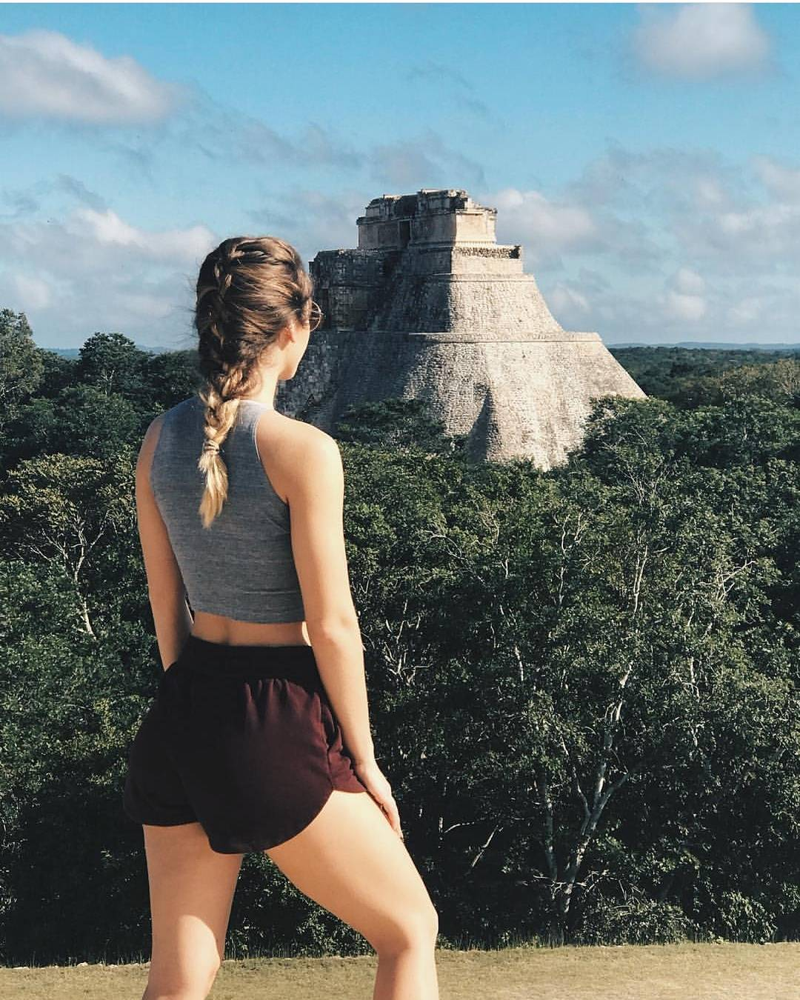

import { Link } from "gatsby"

_Explora cada rincón de la mágica Uxmal y descubre sus secretos_

La ocupación del sitio se remonta al Preclásico Superior alrededor del año 500 a.C., sin embargo el mayor volumen de la obra constructiva se realiza durante el Clásico Tardío (600 – 1000 d.C.) y va hasta el Clásico Terminal (1000 – 1150 d.C.).

https://youtu.be/bolEfZrbr_Y

“La tres veces construida” o “Lugar en donde se cosecha con abundancia” se ubica a 78 km. de la ciudad de Mérida, tomando la carretera federal, tomando la carretera federal 261 que conduce a Campeche. La zona está rodeada de una hilera de cerros que enmarca la serie de asentamientos caracterizados por la proporción de sus edificios y sus fachadas bellamente decoradas en filigrana de piedra. Con innegables características estéticas, producto de una cultura que con su sabiduría y extraordinaria precisión del tiempo aún causa fascinación, los mayas nos muestran cómo la energía social fue canalizada a la construcción con un profundo sentido de la arquitectura que en esta región se identifica con el nombre de estilo “Puuc”.

En Uxmal se encuentra la obra más representativa de éste estilo: “La Casa del Gobernador”, considerado por los expertos una maravilla arquitectónica por su precisión y belleza. Pero la admiración dejará sentirse desde la entrada al sitio, con la bienvenida que nos da “El Templo del Adivino” con sus imponentes 35 m de altura, encierra en su singular forma elíptica un gran número de enigmas aún por descubrir; excavaciones recientes lo definen como un centro de actividad ritual y residencia de Chaac, el último gobernante de Uxmal, frente a él se percibe su majestuosidad que nos invita a descubrir en cada uno de los edificios las revelaciones de una civilización asombrosa.

La fertilidad de los suelos y el alto potencial de recursos de la región fueron entre otros dos de los factores que favorecieron para alcanzar un nivel tan desarrollado en muchos aspectos. Digno de mencionar es su obra de ingeniería hidráulica para la recaudación de agua de lluvia, esta práctica se materializó mediante chultunes o cisternas con capacidad de 20 a 35 mil litros de agua de los que se han encontrado sólo en el núcleo central de Uxmal, más de 160.

El control político y económico era regido por un selecto grupo de individuos ya que la sociedad los reconocía como intermediarios entre los hombres y las divinidades. Fue así como, por medio de la religión, la clase dirigente monopolizó las principales actividades en sus diversas manifestaciones de la población asentada en Uxmal. Poco a poco la “Tres veces construida” fue transformándose en una de las principales capitales regionales de los mayas del norte, hasta lograr el establecimiento de un poder político que permitió el control de otros sitios menores y que hizo posible que Uxmal se estableciera como capital regional del Puuc.

Entre todas etas razones, visitar Uxmal se le agrega el ser un sitio declarado patrimonio de la Humanidad, que nos hace adentrarnos a un capítulo en el que dejó huella imborrable la cultura maya. Además que será un enlace para descubrir una de las rutas más interesantes y relevantes en la historia de Yucatán: La ruta Puuc.

## Hoteles en Uxmal
import InsertaScript from  "../../components/Complete/InsertaScript"

<InsertaScript liga="https://www.travelpayouts.com/blissey/scripts_es.js?categories=popularity&id=1421131&type=compact&marker=182367.tyucatan&powered_by=false&host=hoteles.tyucatan.com%2Fhotels&locale=es&currency=mxn&limit=10&nobooking=true" />

#### Ubicación de Uxmal
import Map from "../../components/Map"

<Map
          lat="20.363456"
          lng="-89.771176"
          zoom={8}
          mensaje="Valladolid, Yucatán"
/>

<Link to="/posts" className="btn center-btn">
  all posts
</Link>
