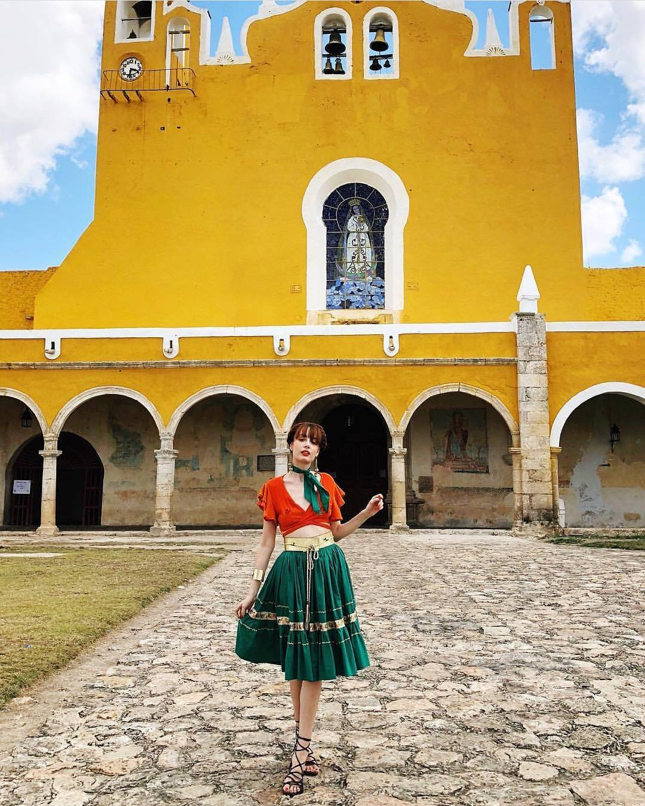

import { Link } from "gatsby"

La ciudad de las “Tres culturas”, llamada así, por reunir las etapas Prehispánica, Colonial y Contemporánea, está ubicada en la parte central del estado de Yucatán, con una historia que se prolonga por más de 2 milenios. Sus grandes edificios prehispánicos construidos para el culto del dios Zamná, deidad sabia y benefactora de los antiguos mayas, se levantan muy próximos al célebre convento dedicado a la Virgen de Izamal, construido durante los primeros años de la dominación española por los frailes franciscanos, que su afán de evangelizar estuvo acompañado de un gran esfuerzo constructivo, lo que dejó monumentos de gran valor en la península yucateca.

Forma parte de la denominada “Ruta turística de Oriente” que comprende Mérida – Izamal – Chichén Itzá – Valladolid – Ex Balam – Culubá – Río Lagartos. Las numerosas construcciones prehispánicas localizadas dentro de la ciudad, algunas de ellas de gran tamaño y actualmente en proceso de restauración, hacen un hermoso contraste con los vestigios de la época colonial y constituyen un atractivo único en la región.

https://youtu.be/yKKVHu9GqDE

Entre sus principales atractivos se encuentra el Convento Franciscano concluido en 1562 y punto de peregrinación de numerosos creyentes, que vienen a orar a los pies de Nuestra Señora de Izamal. Fue construido por el arquitecto Fray Juan Mérida, bajo la dirección del célebre Fray Diego de Landa, sobre uno de los edificios de la ciudad. La extraordinaria arquería de su atrio, las clásicas proporciones de su iglesia, o la vista que se observa desde el elevado camarín de la Virgen, hace de este sitio un punto obligado a la visita.

El Kinich Kakmo es el edificio prehispánico de mayor tamaño en Yucatán pues ocupa una superficie de 4 hectáreas. La escalinata del costado sur con las enormes piedras utilizadas en su construcción es una evidencia del enorme esfuerzo del pueblo maya para rendir culto a sus deidades. Merecen también una visita el Itzamatul, el Habuc y Chaltunha pues cada uno de ellos son testimonios de lejanas épocas.

Considerada una joya colonial, todos los edificios están pintados de amarillo, color que contrasta con el azul del cielo y le da un sello particular a la ciudad. En ella se han llevado a cabo eventos relevantes como la inauguración y clausura del Ki Huic turístico del mundo maya, así como la visita del Papa Juan Pablo II. Sus calles limpias, tranquilas y seguras, transitadas por calesas y numerosas bicicletas, sus parques y plazas rodeadas de portales y su excelente gastronomía, son una invitación para conocer Izamal.

<blockquote>Descubre las maravillas, el color y la calidez que Yucatán tiene para ti</blockquote>

## Hoteles en Izamal
import InsertaScript from  "../../components/Complete/InsertaScript"

<InsertaScript liga="https://www.travelpayouts.com/blissey/scripts_es.js?categories=popularity&id=1476970&type=compact&marker=182367.tyucatan&powered_by=false&host=hoteles.tyucatan.com%2Fhotels&locale=es&currency=mxn&limit=10&nobooking=true" />

<Link to="/posts" className="btn center-btn">
  todos los posts
</Link>
