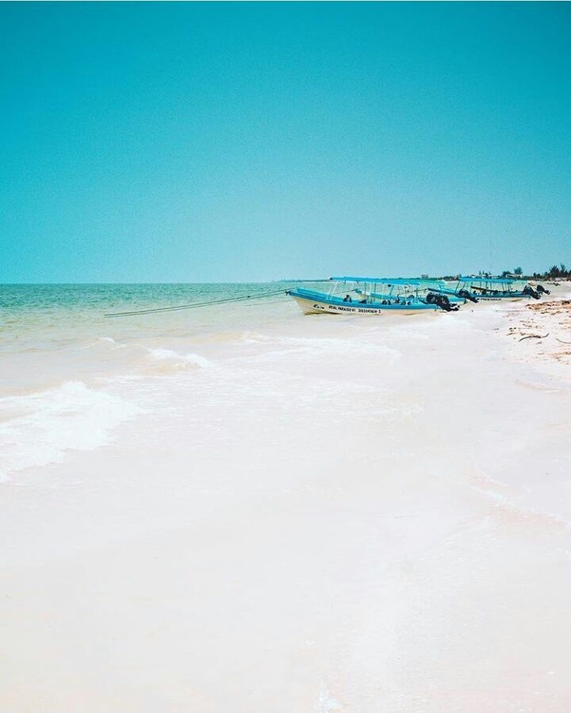

import { Link } from "gatsby"
import InsertaScript from  "../../components/Complete/InsertaScript"

_En Yucatán la vida, como los paisajes es en rosa..._

Famoso como un santuario de aves, Celestún hace una buena excursión de un día a la playa y a las aves desde Mérida.

Aunque esta región abunda en anhingas y garcetas, la mayoría de los observadores de aves vienen aquí para
ver los flamencos

https://youtu.be/lJ8hgkRqwaI

La ciudad está ubicada en un tramo de tierra entre el Río Esperanza y el Golfo de México. 
La brisa marina del oeste refresca la ciudad la mayoría de los días. La playa de arena blanca es atractiva, 
pero algunos días es feroz por la tarde vientos remolinan nubes de polvo asfixiante
la ciudad. El polvo hace que el mar sea limoso, anc
por lo tanto desagradable para nadar en el
tarde, fila sobre fila de barcos de pesca
Equipado con postes largos gemelos que bordean la orilla.
Dados los vientos, el mejor momento para ver pájaros es
por la mañana.

Hay dos lugares para alquilar un barco para
observación de aves: desde el puente en lo alto
camino a la ciudad a unos 1,5 km de la playa,
o desde el océano. El más atractivo de
las opciones son las últimas. El '' paseo marítimo '' dura
aproximadamente 21/2 horas e inicialmente involucra una
Paseo en bote de 10 km paralelo a la costa y
hacia el norte. Durante esta porción de la
recorrido puede esperar ver garcetas, garzas,
cormoranes, lavanderas y muchos otros
especie de ave. El barco gira hacia el interior,
pasando por un bosque petrificado donde altos árboles costeros que alguna vez pertenecieron a un ecosistema de agua dulce fueron asesinados hace más de un milenio, probablemente por un huracán que contaminó el agua dulce con agua de mar. Hoy, los árboles son tan duros como la roca.

<blockquote display="info">Se encuentra aproximadamente a 90 Kilómetros de Mérida </blockquote>

https://youtu.be/WVIHU0Rkit4

Después del bosque pasarás por un río / laguna donde los pescadores pescan camarones y cangrejos. Pronto llegarás a un puente (el puente de la carretera a la entrada de la ciudad), entre los cuales se puede ver a los flamencos pescando por su cuenta. Dependiendo de la marea, puede ver cientos o miles de pájaros coloridos aquí. Después de ver las aves, el recorrido por el mar pasa por los manglares hasta un cenote de agua dulce para un refrescante chapuzón (asegúrese de usar un traje de baño debajo de su ropa este día).

<blockquote>La extensa costa yucateca está llena de hermosas sorpresas, sólo tienes que salir a explorar...</blockquote>

https://youtu.be/ZEysHm4ng5o

## Hoteles en Celestúm
<InsertaScript liga="https://www.travelpayouts.com/blissey/scripts_es.js?categories=popularity&id=4379&type=compact&marker=182367.tyucatan&powered_by=false&host=hoteles.tyucatan.com%2Fhotels&locale=es&currency=mxn&limit=10&nobooking=true" />

<Link to="/posts" className="btn center-btn">
todos los posts
</Link>
