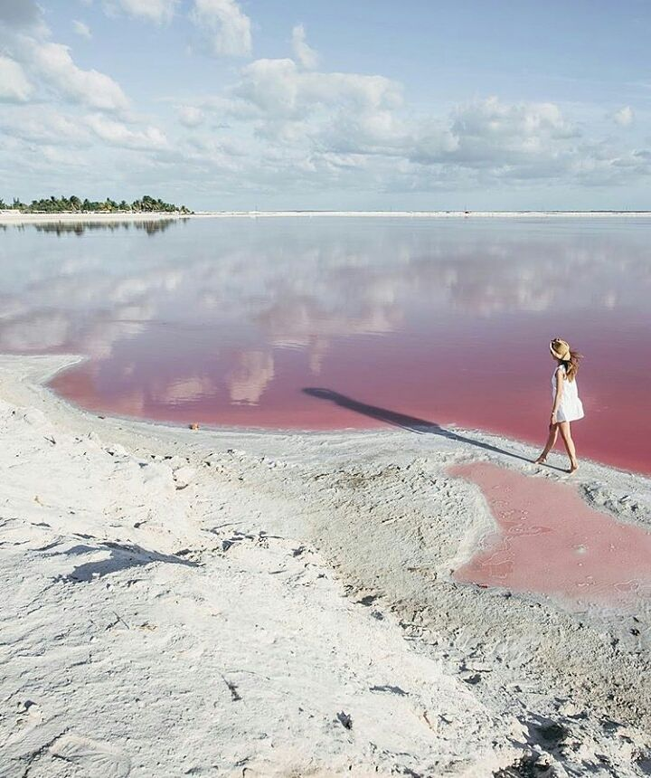

import { Link } from "gatsby"

_Ven por la naturaleza, quédate por la magia._

En Yucatán existen cosas tan increíbles como Río lagartos donde el agua es de color Rosa

https://youtu.be/O6Ck8scYnCI

Los paisajes y la fauna natural son de los grandes atractivos que tiene Yucatán, en la Reserva de la Biósfera
de Ría Lagartos se encuentra una salinera famosa por sus grandes lagunas de color rosado, mejor conocidas como "Las Coloradas".

#### Ubicación de Las Coloradas
import Map from "../../components/Map"

<Map
          lat="21.604798"
          lng="-87.991854"
          zoom={8}
          mensaje="Las Coloradas"
/>

<Link to="/posts" className="btn center-btn">
todos los posts
</Link>
