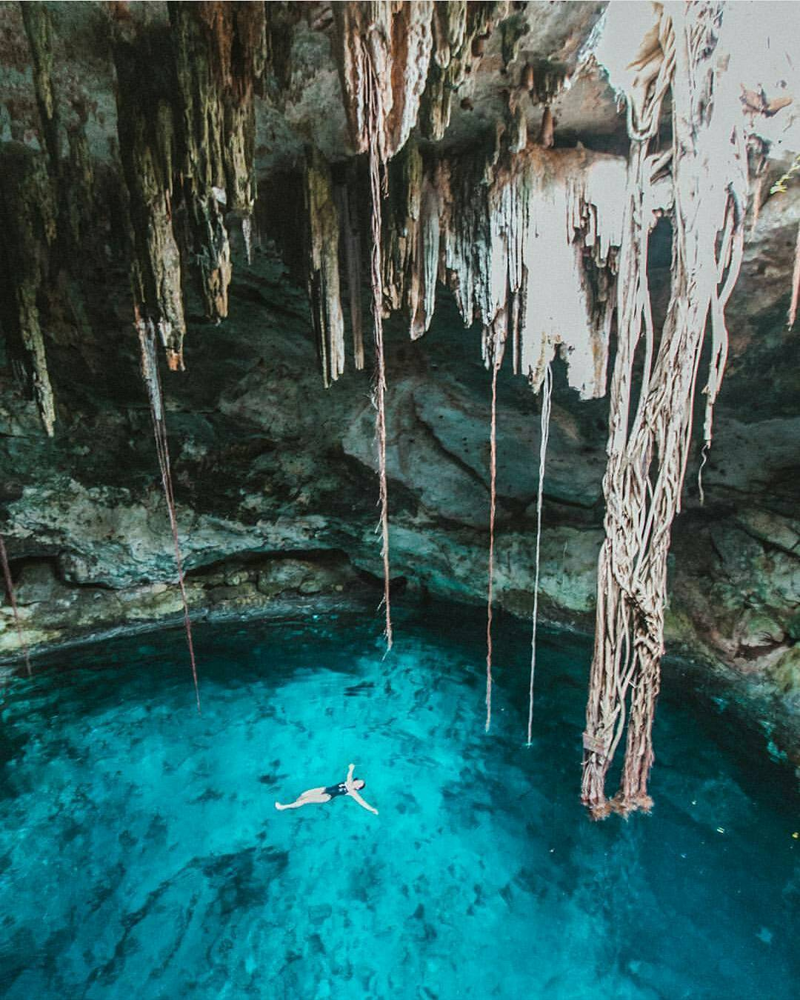

import { Link } from "gatsby"

_Después de recorrer la increíble Chichén Itzá puedes refrescarte nadando en esta maravilla de la naturaleza..._

En un territorio sin ríos en la superficie, los depósitos naturales de agua dulce o cenotes fueron considerados por los antiguos mayas como un regalo de los dioses. El más venerado de todos fue el Cenote Sagrado de Chichén Itzá que atraía a peregrinos desde los confines de Mesoamérica. Hoy en día, tal como en el pasado, todas las poblaciones mayas son erigidas en torno a una fuente del vital líquido. Muchos, por su gran belleza natural, son aprovechados por el ecoturismo.

El suelo calcáreo de la Península de Yucatán absorbe el agua de lluvia, la cual se almacena en el subsuelo en forma de cuevas inundadas y corrientes subterráneas. Debido a la erosión del terreno, las bóvedas se van colapsando, dejando –a veces parcialmente- al aire libre los depósitos de agua. Los cenotes son verdaderos oasis en medio de la selva con un ecosistema único en el mundo, que invitan a nadar en sus aguas frescas y transparentes. Se puede incluso practicar el esnórquel o el espeleobuceo para admirar con mayor detenimiento la belleza de las rocas fosilizadas así como las estalactitas y las estalagmitas, y contemplar el mundo fantástico de sus profundidades, poblado de seres alucinantes. Algunos se localizan cerca de las antiguas haciendas henequeneras y se puede acceder a ellos por medio de un pintoresco “truck”, que es un pequeño vagón tirado por un caballo.

En la Sierrita de Calcehtok, cuya entrada se encuentra a 40 m. de profundidad, invitan al rappel. Deslizándose por sus paredes rocosas, se llega a un lujuriante jardín selvático. Desde ahí, se recorren dos kilómetros de galerías con sorprendentes formaciones rocosas, salones solemnes y vestigios prehistóricos.

El calor no existe cuando puedes refrescarte en las criztalinas aguas de un cente como Cuzamá

<Link to="/posts" className="btn center-btn">
todos los posts
</Link>
